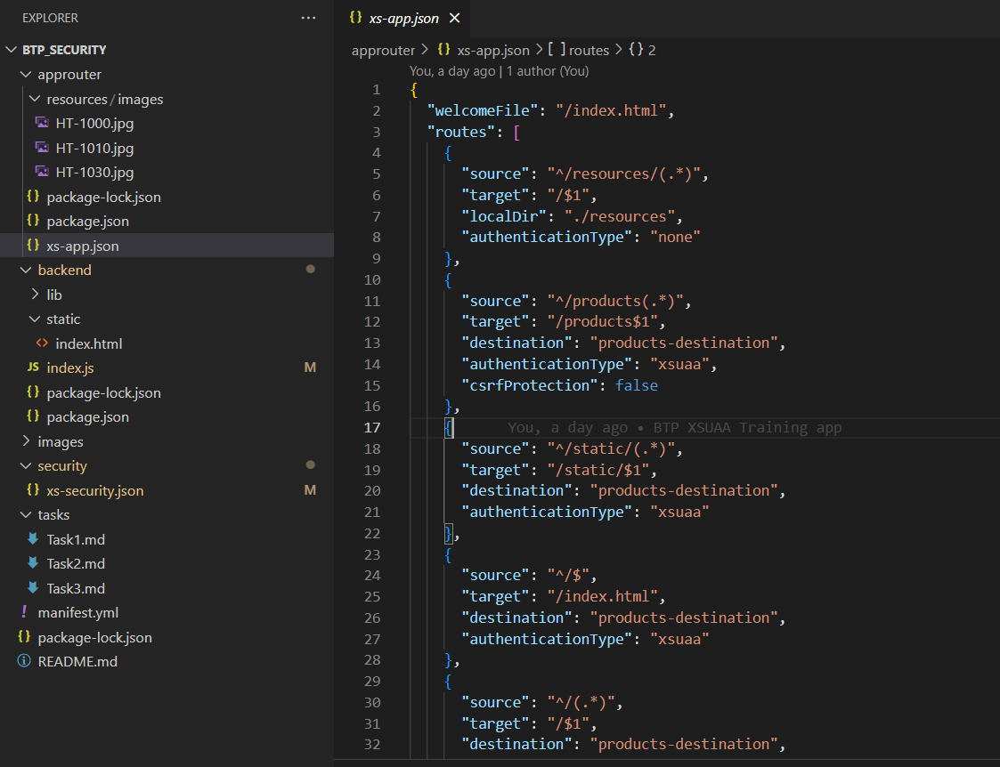

# Task 3: Protect the `/resources` Endpoint with XSUAA

In this task, you will secure the `/resources` endpoint by requiring authentication through XSUAA. This will involve viewing a resource without protection, adjusting configuration to implement security, and observing the changes.

### Objective
- Secure the `/resources` endpoint by requiring a minimum authorization level using XSUAA.

## Steps

### Step 1: Access the `/resources/image/HT-1000.jpg` Resource Unprotected

1. **Open a New Incognito Browser:**
   - Make sure you're not logged in to avoid inherited session credentials.
  
2. **Access the Image:**
   - Enter the URL: `https://frontendGroupxx.cfapps.us10-001.hana.ondemand.com/resources/images/HT-1000.jpg` (replace `xx` with your specific group identifier).

3. **Describe Your Observations:**
   - What do you see? Why can you access the image without logging in? Note down your observations.

### Step 2: Update `xs-app.json` to Require Authorization

1. **Open `xs-app.json`:**
   - Navigate to `btp_security/approuter/xs-app.json`.

2. **Modify the Route:**
   - Update the `/resources` route to require at least one XSUAA role for access.

   Replace the current route configuration from:
   ```json
   {
     "source": "^/resources/(.*)",
     "target": "/$1",
     "localDir": "./resources",
     "authenticationType": "none"
   }
   ```

   With:
   ```json
   {
     "source": "^/resources/(.*)",
     "target": "/$1",
     "localDir": "./resources",
     "authenticationType": "xsuaa",
     "scope": "$XSAPPNAME.read"
   }
   ```
   This change ensures that only users with the `read` scope can access the resources.

3. **Save your changes.**

### Step 3: Deploy Updates

1. **Deploy the Changes:**
   - Go to the terminal within the `btp_security` directory and execute:
   ```bash
   cf push approuter
   ```
   This command updates the application with your new configuration.

2. **Verify Deployment:**
   - After deployment is complete, check your routes using:
   ```bash
   cf apps
   ```

### Step 4: Test the Protected Endpoint

1. **Open a New Incognito Browser:**
   - Make sure no credentials are cached from previous sessions.

2. **Access the Image Again:**
   - Visit `https://frontendGroupxx.cfapps.us10-001.hana.ondemand.com/resources/images/HT-1000.jpg`.

3. **Observe the Effect:**
   - Are you prompted to log in? What happens if you are not authorized? Record your observations now that the endpoint requires authentication.

